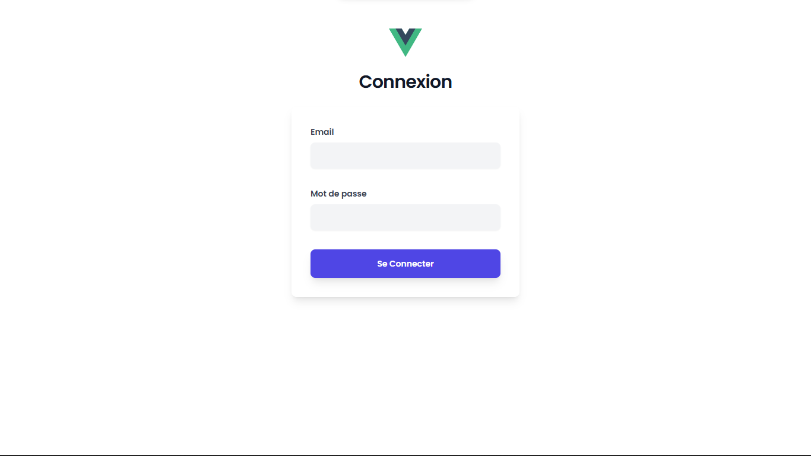
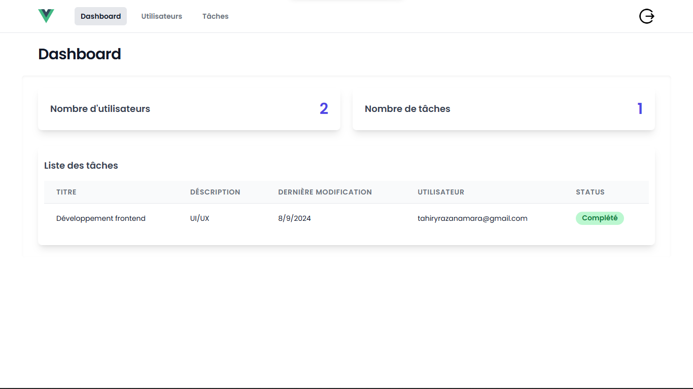
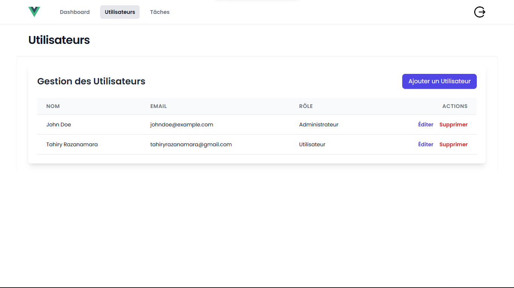
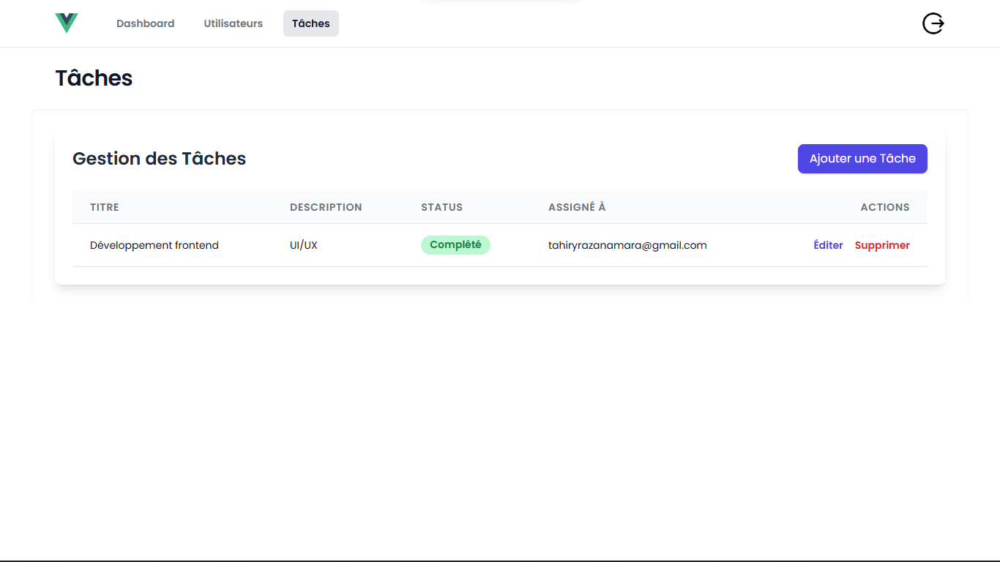
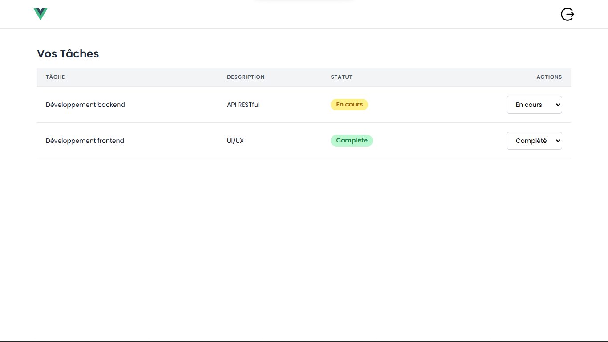

# Application de Gestion de Projets

Cette application de gestion de projets est développée avec Vue 3 pour le frontend et Express pour le backend. Elle utilise TailwindCSS pour le stylisme du frontend et Sequelize pour l'interaction avec la base de données MySQL.

## Prérequis

- Node.js
- MySQL

## Installation

### Backend

1. Clonez le dépôt et accédez au répertoire du projet :

   ```bash
   git clone https://github.com/RazTahiry/Gestion_des_projets.git
   cd Gestion_des_projets
   ```

2. Accédez au répertoire du backend :

   ```bash
   cd backend
   ```

3. Configurez la connexion à la base de données en vérifiant les informations dans `config/config.js`. Assurez-vous de mettre le `username`, le `password`, et le `host` correctement dans la section `development` de ce fichier.

4. Installez les dépendances :

   ```bash
   npm install
   ```

5. Créez la base de données :

   ```bash
   npm run create-db
   ```

6. Exécutez les migrations :

   ```bash
   npm run migrate
   ```

7. Insérez des données de base (seed) :

   ```bash
   npm run seed
   ```

8. Lorsque tout est configuré avec succès, notez que les identifiants de l'admin pour vous connecter sont :

   - **Email** : `johndoe@example.com`
   - **Mot de passe** : `12345678`

9. Lancez le serveur :

   ```bash
   npm run dev
   ```

### Frontend

1. Accédez au répertoire du frontend :

   ```bash
   cd ../frontend
   ```

2. Installez les dépendances :

   ```bash
   npm install
   ```

3. Lancez le serveur de développement :

   ```bash
   npm run dev
   ```

4. Accédez à l'application via [http://localhost:5173/](http://localhost:5173/) pour tester le frontend.


- **Vérification du port utilisé par l'API backend :**

  Assurez-vous que le port configuré pour l'API backend est le même dans les fichiers de configuration du frontend et du backend. Pour cela, vérifiez les fichiers `.env` situés dans les répertoires `frontend` et `backend`.

  - Dans le fichier `frontend/.env`, recherchez la variable qui définit l'URL de l'API backend. Cette URL doit inclure le même port que celui utilisé par le backend.

  - Dans le fichier `backend/.env`, vérifiez que le port sur lequel le serveur backend écoute est correctement défini et correspond à celui configuré dans le frontend.

  Exemple :

  - `frontend/.env` :

    ```plaintext
    VITE_API_BASE_URL=http://localhost:3000/api/v1
    ```

  - `backend/.env` :
    ```plaintext
    PORT=3000
    ```

  Assurez-vous que le `PORT` dans `backend/.env` correspond au port utilisé dans `VITE_API_BASE_URL` du fichier `frontend/.env`.

## Utilisation

1. **Page d'accueil :**

   - Page d'accueil de l'application

   

2. **Connexion :**

   - Cliquez sur "Se connecter" pour accéder à la page de connexion.
   - Entrez les identifiants admin : `johndoe@example.com` et `12345678`.
   
   

3. **Dashboard :**

   - Après connexion, accédez au tableau de bord qui affiche le nombre d'utilisateurs et de tâches ainsi qu'une liste de toutes les tâches.
   
   

4. **Gestion des utilisateurs :**

   - Accédez au menu "Utilisateurs" pour gérer les utilisateurs (CRUD).
   
   

5. **Gestion des tâches :**

   - Accédez au menu "Tâches" pour gérer les tâches (CRUD).
   
   

6. **Ajout et gestion des utilisateurs :**

   - Essayez d'ajouter un utilisateur avec le rôle "utilisateur" et attribuez-lui une ou plusieurs tâches.
   - Déconnectez-vous et reconnectez-vous en tant que l'utilisateur que vous venez de créer.
   - Vous verrez les tâches assignées à cet utilisateur et pourrez changer le statut de chaque tâche.
   
   

## Notes

- Assurez-vous que votre base de données MySQL est en cours d'exécution avant de lancer les migrations et les seeds.
- Le backend écoute sur le port 3000 par défaut, et le frontend sur le port 5173.

## Limitations

### Problèmes connus

1. **Actualisation manuelle après le login :**
   - Actuellement, l'application nécessite une actualisation manuelle de la page après la connexion pour que les changements soient pris en compte.

2. **Gestion des erreurs :**
   - La gestion des erreurs n'est pas encore entièrement implémentée. Certains scénarios d'erreur pourraient ne pas être correctement traités, ce qui peut conduire à des messages d'erreur non informatifs ou à des comportements inattendus.
